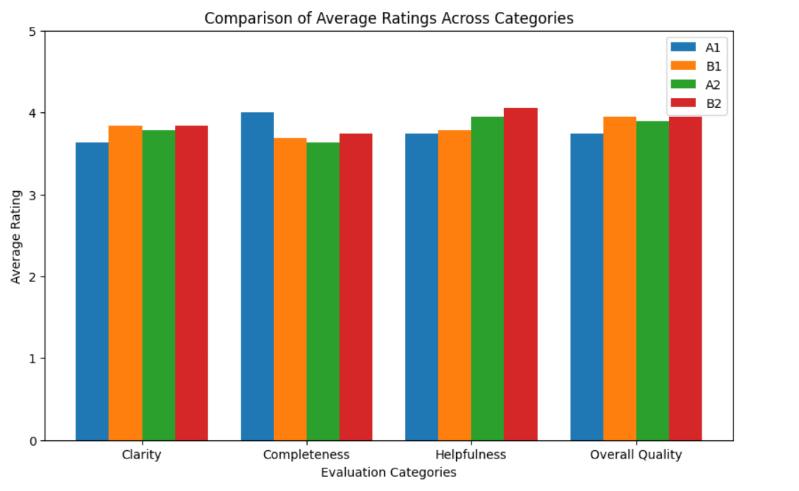
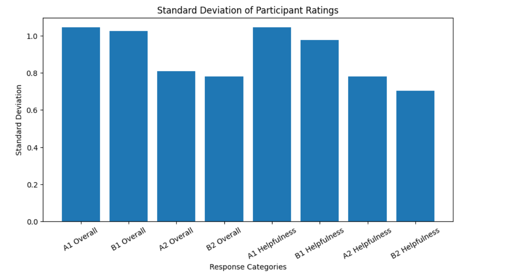
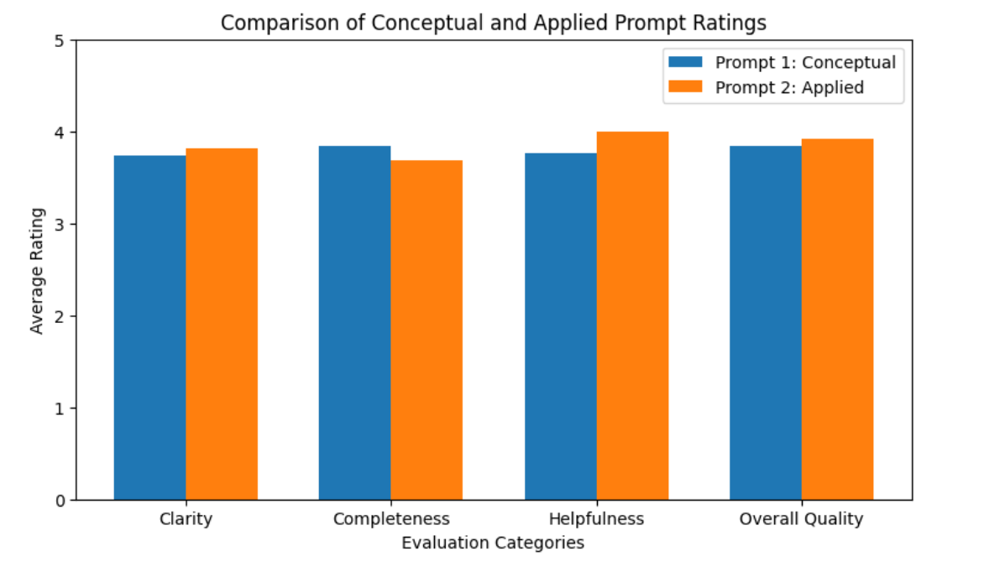
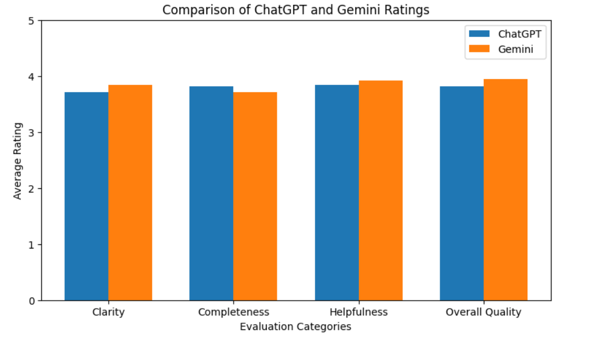

---

# Human Evaluation of AI-Generated Responses

### Comparing participant perceptions of ChatGPT and Gemini across conceptual and applied data science prompts

**Ruth Chane**  
CS-215 Final Project  
Whitman College  
5/16/2026

---
## Why I Chose This Topic

AI-generated responses are becoming increasingly common in education, coding, research, and everyday problem solving. While many discussions around AI focus on technical performance, I became interested in the human side of AI evaluation: how people actually perceive and judge AI-generated explanations.

Instead of using a pre-existing dataset, I wanted to design my own small-scale human evaluation experiment. This project allowed me to combine my interests in AI, data science, and human-centered analysis while also gaining experience building and analyzing an original dataset.
---

## Project Overview

For my final project, I analyzed how people evaluate AI-generated responses to data science questions. I designed my own survey, collected human ratings, cleaned the exported data, and analyzed patterns in how participants judged AI responses.

The project compared responses from ChatGPT and Gemini across two prompt types:

- a conceptual machine learning prompt about overfitting
- an applied data-cleaning prompt about missing values and inconsistent labels

Participants rated responses across four categories: clarity, completeness, helpfulness, and overall quality.
---

## Research Questions

This project explored the following questions:

- Which AI-generated responses received the highest overall ratings?
- Were some evaluation categories rated more consistently than others?
- Did ChatGPT or Gemini tend to receive higher ratings across clarity, completeness, helpfulness, and overall quality?
- Did participants evaluate conceptual and applied prompts differently?

---
## A Note About the Data

This dataset was collected through Google Forms surveys distributed to students and community members on campus. Participants came from a variety of academic backgrounds, including both technical and non-technical disciplines.

A total of 19 completed survey responses were collected across four survey versions. I intentionally created multiple versions in order to vary response order and reduce response-order bias during evaluation.

Because the project focused on human evaluation, participant subjectivity was an important part of the dataset. Different backgrounds, levels of technical familiarity, and personal interpretation styles likely influenced how responses were rated.

One survey question was accidentally not marked as required, which resulted in one missing value in the dataset. I kept the missing value as `NaN` rather than deleting the response entirely.

---

## Prompt Design

To evaluate how people perceive AI-generated explanations across different contexts, I selected two prompt types.

### Prompt 1: Conceptual

“Explain what overfitting is in machine learning in simple terms and why it can be a problem.”

### Prompt 2: Applied

“Imagine you are working with a dataset that has missing values and inconsistent or messy labels. What steps would you take to clean the data before using it?”

These prompts were intentionally chosen because they represent different forms of data science communication. The first prompt focuses on conceptual explanation, while the second focuses on practical problem-solving and workflow reasoning.

For each prompt, responses were generated using both ChatGPT and Gemini. During the survey process, the responses were anonymized as “Response A” and “Response B” so that participants would evaluate the content itself rather than the model name.

---

## Data Cleaning and Wrangling

The raw data came from four separate Google Forms exports. Before analysis, several preprocessing and cleaning steps were required.

These included:

- combining multiple CSV exports into one dataset
- standardizing inconsistent column names
- checking missing values
- converting survey ratings into numerical values
- organizing responses into structured evaluation categories

Although the dataset was relatively small, the cleaning process showed how even small real-world datasets often require significant preprocessing before meaningful analysis can happen.

---
## Exploratory Analysis and Findings

After cleaning the dataset, I calculated descriptive statistics and compared average participant ratings across the evaluation categories.

The analysis focused on four categories:

- Clarity
- Completeness
- Helpfulness
- Overall Quality

The ratings used a 1–5 scale, where higher values represented stronger evaluations.

---

## Comparing Average Ratings Across Responses

The first stage of analysis examined average ratings across the different AI-generated responses.

### Main Insight

Across most categories, the average ratings were relatively high, generally falling between 3.6 and 4.1 out of 5. This suggests that participants viewed most responses as reasonably strong overall.

Among the response groups, the Gemini responses tended to receive slightly higher ratings in helpfulness and overall quality, while ChatGPT responses scored slightly higher in completeness for one of the prompts.

Although the differences were not dramatic, the results suggest that participants perceived subtle differences in explanation style, structure, and usefulness between the models.

---

## Comparing Evaluation Categories

To better understand where differences appeared, I compared average ratings across clarity, completeness, helpfulness, and overall quality.

### Main Insight

The applied data-cleaning prompt generally received slightly higher helpfulness and overall quality ratings than the conceptual overfitting prompt.

This may suggest that participants responded more positively to practical, workflow-oriented explanations than purely conceptual explanations. Participants may have found step-by-step practical guidance easier to evaluate and more directly useful.

Completeness ratings remained relatively strong across both prompts, showing that participants generally believed the responses addressed the questions effectively.

---

## Consistency of Participant Ratings

To study variation in participant opinions, I also calculated standard deviations for the rating categories.

### Main Insight

Some categories showed lower standard deviation values, meaning participant ratings were relatively consistent. Other categories showed greater variation, suggesting participants interpreted response quality differently depending on the explanation style or prompt type.

The highest variation appeared in some overall quality and helpfulness ratings, which may reflect how subjective those categories can be during human evaluation.

This analysis demonstrated that human-centered AI evaluation is not purely objective. Different participants may prioritize different qualities when judging AI-generated explanations.

---

## Comparing Conceptual and Applied Prompts

I also compared average ratings between the conceptual prompt and the applied prompt.

### Main Insight

The applied data-cleaning prompt generally received slightly higher ratings in helpfulness and overall quality. In contrast, the conceptual prompt performed slightly better in completeness.

One possible explanation is that participants may have preferred responses that offered actionable steps and practical guidance rather than abstract explanation alone.

This comparison highlights how prompt type itself can influence human evaluation of AI-generated responses.

---

## Comparing ChatGPT and Gemini

After anonymized evaluation was completed, I mapped the responses back to their original AI systems to compare ChatGPT and Gemini directly.

### Main Insight

Both models performed similarly overall, with average ratings remaining relatively close across categories.

Gemini received slightly stronger ratings in helpfulness and overall quality, while ChatGPT performed slightly better in completeness. However, the differences were relatively small, suggesting that both systems produced responses participants considered useful and understandable.

Rather than identifying a single “better” model, the results suggest that participant preferences may depend more on explanation style and communication approach than on large differences in technical performance.

## Limitations and Future Work

This project was exploratory because it included 19 survey responses and only two prompts. Participant backgrounds also varied, which may have influenced how people interpreted the responses.

If I had more time, I would collect more responses, include more prompt types, compare additional AI systems, and separate technical and non-technical participants for deeper analysis.

---

## New Technique Learned

One new technique I explored during this project was creating grouped comparison visualizations to analyze multiple evaluation categories across different AI responses and prompt types.

I also learned more about survey design and response-order bias while creating the dataset. To make the evaluation process more balanced, I designed four different survey versions with varying response order and anonymized the AI systems as “Response A” and “Response B” so that participants would evaluate the content itself rather than the model name.
---

## Reflection

Through this project, I learned how much work goes into building and analyzing a real dataset from start to finish. Instead of working with a pre-existing dataset, I designed my own survey process, collected responses, combined multiple datasets, cleaned inconsistent exports, and organized the data into a format suitable for analysis.

One of the most interesting parts of the project was seeing how human perception shapes evaluations of AI-generated responses. I originally expected participants to focus mostly on whether responses answered the question correctly, but the results showed that clarity, structure, explanation style, and perceived usefulness also strongly influenced ratings.

This project also helped me better understand how important data cleaning and preprocessing are in real-world data science workflows. Even with a relatively small dataset, issues such as inconsistent columns, formatting problems during export, and missing values required careful debugging and organization before analysis could begin.

In addition, I gained more experience using Python, Pandas, NumPy, and Matplotlib to clean data, calculate descriptive statistics, and create visualizations that communicate findings clearly.

I also enjoyed exploring a more human-centered approach to data science and AI evaluation. Since AI systems are becoming increasingly integrated into education, work, and communication, understanding how people interpret and trust AI-generated responses feels especially important and relevant.

Overall, this project gave me a much deeper understanding of the complete data science process, from designing research questions and collecting data to interpreting results and presenting findings through storytelling and visualization.

---

## Tools and Technologies Used

- Python
- Pandas
- NumPy
- Matplotlib
- Google Forms
- Google Colab
- GitHub Pages
- Gemini
- ChatGPT

---

## Repository Contents

This repository includes:

- the final analysis notebook
- cleaned survey data
- visualizations used in the project
- GitHub Pages website files
- written project documentation
